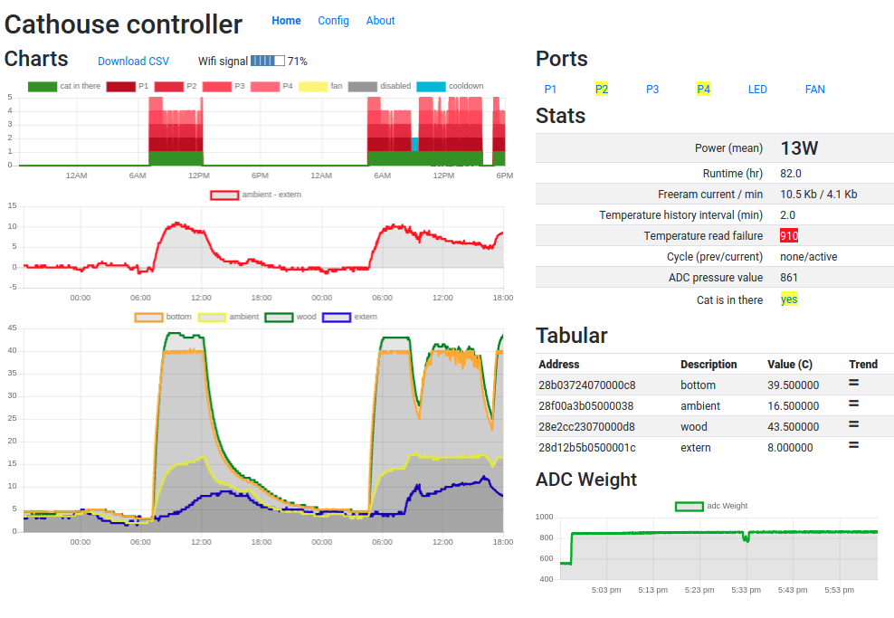
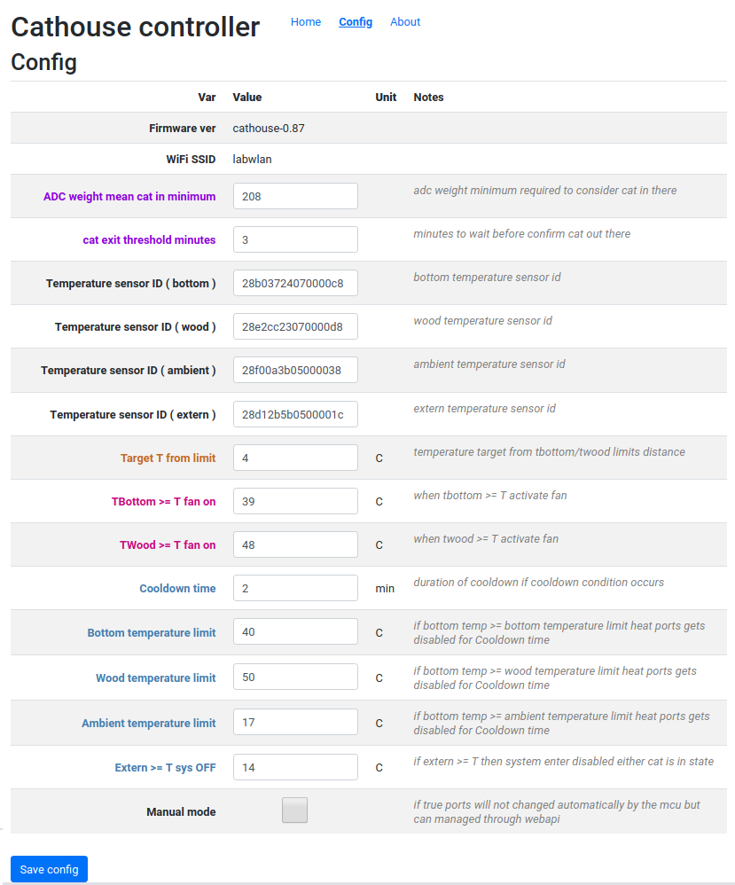

# iot-cathouse-controller

- [requirements](#requirements)
  * [thirdy part libraries](#thirdy-part-libraries)
- [initial setup](#initial-setup)
  * [set wifi ssid and pwd](#set-wifi-ssid-and-pwd)
  * [parameter configurations](#parameter-configurations)
  * [set temperature sensor ids](#set-temperature-sensor-ids)
- [debug](#debug)





## features

- complete cathouse project ( building walls, heating system, weight detect, wifi control )
- wifi control automatic or manual through webapi ( [example](cathouse-analysis) )

## requirements

- hardware
  - [billing of materials](doc/bom.xlsx)
  - [instructables](https://www.instructables.com/id/DomoticCathouse/) to build and assembly cathouse parts
  - [nodemcu esp8266](https://www.google.com/search?q=nodemcu+esp8266)
  - [global schematics](https://easyeda.com/editor#id=|c888d1d962eb41688482b3634ec3ae96)
    - [mosfet driver](https://easyeda.com/editor#id=|8c9be83bc0324be699e9c5582d8d355a|41530c0b5fc0479b98395b739bd6d0e3)
    - [loadcell opamp](https://easyeda.com/editor#id=|20ec83ae7a4a4b50ac9ebe939533f176|184084caaad548a8a8d9fdd1c97d6a88|f6c7edf3d70e4a249dd6ca145c1bad17) and [sim](http://everycircuit.com/circuit/4874105232031744)
- software
  - [vscode arduino](https://github.com/devel0/knowledge/blob/master/electronics/vscode-arduino.md)
  - [esp8266 board plugin](https://github.com/esp8266/Arduino#installing-with-boards-manager)

### thirdy part libraries

- [ArduinoJsonWriter](https://github.com/maxpowel/ArduinoJsonWriter)
- [JsonStreamingParser](https://github.com/squix78/json-streaming-parser)
- [StringStream](https://gist.github.com/arcao/3252bb6e5e52493f03726ec32e61395c)

## initial setup

### set wifi ssid and pwd

connect to serial interface of esp8266 through usb cable with minicom at 115200 8N1 and issue `ctrl+c` to stop unsuccesful initial wifi connection then press `?` for SerialOS commands
- `set wifi ssid <ssid>` to set your own wifi ssid
- `set wifi pwd <pwd>` to set your own wifi pwd
- data save automatically into eeprom
- `reconnect` to test new wifi parameters
- check in the serial log which ip assigned to your device ( a better approach is to reserve a fixed wellknown ip address in your network by mapping it from the interface mac address also printed in serial log )

### parameter configurations

- connect to `http://cathouseip` and go to Config page

### set temperature sensor ids

in order to allow the system recognition of temperature sensor for bottom, wood, ambient and extern first there is the need to write down their ids ; use one of existing inet [articles](https://www.google.com/search?q=arduino+ds18b20+id) to find out.
write correspondent temperature IDs in fields ( 16 hex char foreach device )

## debug

```
cd cathouse-controller
code .
```

- to build or check compilation `CTRL+SHIFT+R`
- to upload through USB-serial `CTRL+SHIFT+U`
