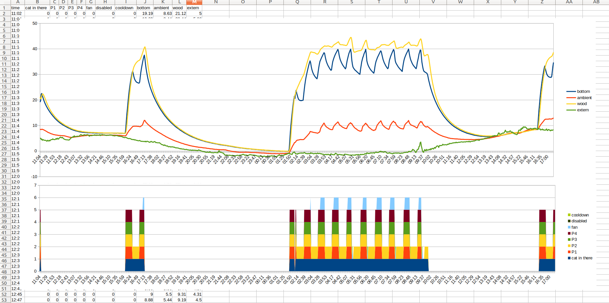

# iot-cathouse-controller

- [features](#features)
- [requirements](#requirements)
  * [thirdy part libraries](#thirdy-part-libraries)
- [initial setup](#initial-setup)
  * [set wifi ssid and pwd](#set-wifi-ssid-and-pwd)
  * [parameter configurations](#parameter-configurations)
  * [set temperature sensor ids](#set-temperature-sensor-ids)
- [config](#config)
  * [cooldown and system off](#cooldown-and-system-off)
  * [manual mode](#manual-mode)
  * [webapi](#webapi)
- [export csv data](#export-csv-data)
- [debug](#debug)
- [security considerations](#security-considerations)


## features

- complete cathouse project ( building walls, heating system, weight detect, wifi control )
- wifi control automatic or manual through webapi ( [example](cathouse-analysis) )

## requirements

- hardware
  - [billing of materials](doc/bom.xlsx)
  - [instructables](https://www.instructables.com/id/DomoticCathouse/) to build and assembly cathouse parts
  - [nodemcu esp8266](https://www.google.com/search?q=nodemcu+esp8266)
  - [global schematics](https://easyeda.com/editor#id=|c888d1d962eb41688482b3634ec3ae96)
    - [mosfet driver](https://easyeda.com/editor#id=|8c9be83bc0324be699e9c5582d8d355a|41530c0b5fc0479b98395b739bd6d0e3)
    - [loadcell opamp](https://easyeda.com/editor#id=|20ec83ae7a4a4b50ac9ebe939533f176|184084caaad548a8a8d9fdd1c97d6a88|f6c7edf3d70e4a249dd6ca145c1bad17) and [sim](http://everycircuit.com/circuit/4874105232031744)
- software
  - [vscode arduino](https://github.com/devel0/knowledge/blob/master/electronics/vscode-arduino.md)
  - [esp8266 board plugin](https://github.com/esp8266/Arduino#installing-with-boards-manager)

### thirdy part libraries

- [ArduinoJsonWriter](https://github.com/maxpowel/ArduinoJsonWriter)
- [JsonStreamingParser](https://github.com/squix78/json-streaming-parser)
- [StringStream](https://gist.github.com/arcao/3252bb6e5e52493f03726ec32e61395c)

## initial setup

### set wifi ssid and pwd

connect to serial interface of esp8266 through usb cable with minicom at 115200 8N1 and issue `ctrl+c` to stop unsuccesful initial wifi connection then press `?` for SerialOS commands
- `set wifi ssid <ssid>` to set your own wifi ssid
- `set wifi pwd <pwd>` to set your own wifi pwd
- data save automatically into eeprom
- `reconnect` to test new wifi parameters
- check in the serial log which ip assigned to your device ( a better approach is to reserve a fixed wellknown ip address in your network by mapping it from the interface mac address also printed in serial log )

### parameter configurations

- connect to `http://cathouseip` and go to Config page

### set temperature sensor ids

in order to allow the system recognition of temperature sensor for bottom, wood, ambient and extern first there is the need to write down their ids ; use one of existing inet [articles](https://www.google.com/search?q=arduino+ds18b20+id) to find out.
write correspondent temperature IDs in fields ( 16 hex char foreach device )

### config


## heat modes

### auto mode

- when cat enters all ports enabled until reaches **Target T from limit** value from either one of bottom toward **Bottom temperature limit** or wood toward **Wood temperature limit**
- if some limit condition occurs system goes off for given cooldown time
  - bottom temp great or equals bottom temp limit
  - wood temp great or equals wood temp limit
  - ambient temp great or equals ambient temp limit
- if external temp great or equals 'Extern >= T sys OFF' then system goes off independently cat is in there or not
- ports are selected in order of preference as from [Config.h](cathouse-controller/Config.h) PORT_PREF
- trend delta can be configured in [Config.h](cathouse-controller/Config.h) TBOTTOM_TREND_DELTA_C

### manual mode

- in manual mode ports and fan can be controlled manually from web interface or webapi
- limit conditions still apply automatically entering the system in cooldown or disabled cycle mode
- led port can be toggled manually either in auto mode

### webapi

| **address** | **content-type** | **result example** |
|---|---|---|
| `/tempdevices` | json | `{"tempdevices":["28b03724070000c8","28f00a3b05000038","28e2cc23070000d8","28d12b5b0500001c"]}` |
| `/temp/devid` | text | retrieve temperature C of given `devid` device |
| `/info` | json | `{"wifiSignalStrength":-59, "statIntervalSec":2, "freeram":11464, "freeram_min":4168, "history_size":1455, "history_interval_sec":118, "temperatureHistoryFillCnt":1455, "temperatureHistoryOff":806, "temp_read_failure":915, "manualMode":false, "adcWeightArraySize":2048, "adcWeightArrayOff":273, "adcWeightArrayFillCnt":2048, "adcWeightArray":[848,847,849,848,...,850], "catIsInThere":true, "p1": false, "p2": true, "p3": false, "p4": true, "led": false, "fan": false, "temp_history_interval_min": 1.966667, "prev_cycle": "none", "current_cycle": "active", "runtime_hr": 82.190266, "Wh": 1087.330255}` |
| `/temphistory` | json | `[{"28b03724070000c8":[8.00,9.00]},{"28f00a3b05000038":[4.44,4]}]` |
| `/bithistories` | json | `{"catInThereHistory":[0,1,1],"p1History":[0,1,1],"p2History":[0,0,0],"p3History":[0,0,0],"p4History":[0,1,1],"fanHistory":[0,0,0],"disabledHistory":[0,0,0],"cooldownHistory":[0,0,0]}` |
| `/port/get/X` | text | `0` |
| `/port/set/X/{0,1}` | text | `OK` or `DENIED` if manualMode false |
| `/port/toggle/X` | text | `OK` or `DENIED` if manualMode false |
| `/setcatinthere/{0,1}` | text | `OK` |
| `/getconfig` | json | `{"tbottomLimit":45.00,"twoodLimit":60.00,"tambientLimit":17.00,"cooldownTimeMs":120000,"texternGTESysOff":14.00,"adcWeightMeanCatInMinimum":600,"catExitThresholdMin":3,"manualMode":false,"tbottomGTEFanOn":42.00,"twoodGTEFanOn":57.00,"targetTempFromLimit":4.00,"firmwareVersion":"cathouse-0.87","wifiSSID":"labwlan","tbottomId":"28b03724070000c8","twoodId":"28e2cc23070000d8","tambientId":"28f00a3b05000038","texternId":"28d12b5b0500001c"}` |
| `/saveconfig` | json POST | |

notes
- `temphistory`, `adcWeightArray`, `bithistories` are a set of measure where latest sample if the current one and previous are distant between each one from specified `history_interval_sec`
- valid ports in `/port/get` and `/port/set` are
  - heating ports ( 1, 2, 3, 4 )
  - led port ( 5 )
  - fan port ( 6 )

## export csv data



- data will be exported using decimal separator dot or comma accordingly to browser locale

## debug

```
cd cathouse-controller
code .
```

- to build or check compilation `CTRL+SHIFT+R`
- to upload through USB-serial `CTRL+SHIFT+U`

- when ENABLE_CORS enabled client side can be debugged without need to upload firmware again simply dragging `index.htm` to the browser so that `app.js` will loaded from local disk

## security considerations

- in release mode set [**ENABLE_CORS**](https://github.com/devel0/iot-cathouse-controller/blob/dbb4c67158c6660667ba5c55b46a064916e80611/cathouse-controller/Config.h#L10) to 0 to avoid browser requests from non owner html page
- on a internet facing page there is the need of a nginx proxy using a letsencrypt **https** certificate to ensure traffic flows in an encrypted channel ; plus there is the need to enable a page **basic authentication** ; see [here](https://github.com/devel0/knowledge/blob/cc771417542ff2cd5af335eec530da644a98c15a/webdevel/nginx-webapi-conf.md) for details
